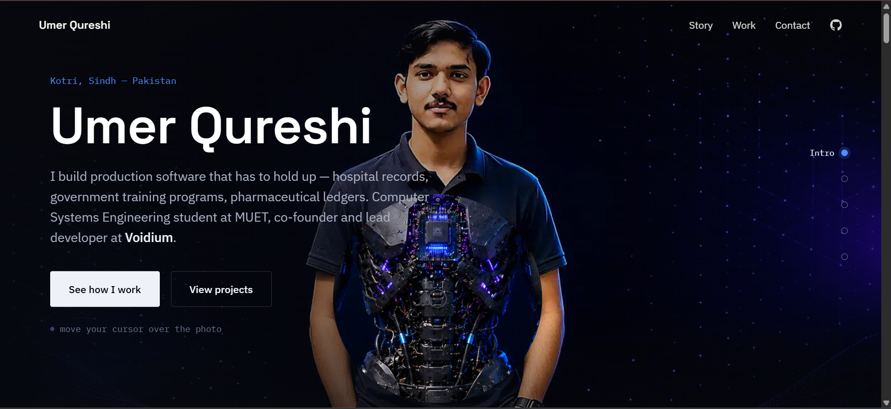

<div align="center">

# Umer Qureshi — Portfolio

**A scroll-driven, cinematic personal portfolio, built as a single continuous story instead of stacked sections.**

[](#)
[](#tech-stack)
[](#getting-started)
[](#license)

</div>

<br>

<p align="center">
  
</p>

<br>

## Overview

This is the personal portfolio of **Umer Qureshi** — a Computer Systems Engineering student at Mehran UET and co-founder & lead developer at Voidium. Instead of a conventional hero-then-sections layout, the entire narrative (intro → about → stack → work → contact) is a **single pinned canvas sequence scrubbed by scroll position** — the same frame-scrubbing technique used on Apple product pages — so the page reads as one continuous shot rather than a series of hard cuts.

It's a vanilla HTML/CSS/JavaScript build with zero frameworks, zero build tooling, and zero runtime dependencies. Every interaction — the cursor-reveal effect, the floating tech-stack icons, the bento project grid, the custom cursor — is hand-rolled.

## Features

| | |
|---|---|
| 🎬 **Scroll-scrubbed story** | 240-frame canvas sequence driven entirely by scroll position, with crossfading text panels synced to each beat — no section boundaries, no jump cuts |
| 🫥 **Cursor-reveal intro** | Moving the pointer (or a finger, on touch) over the opening frame clips a circular window into a hidden layer underneath |
| 🧊 **Floating tech-stack field** | Real, licensed brand marks for the stack, gently parallaxing on cursor movement, with a static fallback on small screens |
| 🧩 **Bento project grid** | Ten shipped and in-progress projects laid out in an asymmetric grid, each with a unique gradient accent instead of identical cards |
| 🖱️ **Custom cursor** | A difference-blended ring that grows over interactive elements, echoing the reveal motif site-wide |
| 🎞️ **Film-grain overlay** | A cheap, GPU-friendly noise layer for a more cinematic, less "flat SaaS" feel |
| ⚡ **Progressive frame loading** | The loader only blocks for the first ~24 frames (~1s of footage); the rest stream in quietly in the background |
| ♿ **Accessible by default** | Visible focus states, `prefers-reduced-motion` support, and a static fallback layout for touch devices |
| 📱 **Fully responsive** | Tuned breakpoints down to small mobile, not just a squeezed desktop layout |

## Tech Stack

No frameworks. No bundler. No `node_modules`.

- **Markup & structure** — semantic HTML5
- **Styling** — modern CSS (custom properties, `clamp()`, `color-mix()`, CSS Grid, `backdrop-filter`)
- **Interactivity** — vanilla JavaScript (`Canvas 2D`, `IntersectionObserver`, `requestAnimationFrame`)
- **Type** — [Space Grotesk](https://fonts.google.com/specimen/Space+Grotesk) (display), [IBM Plex Sans](https://fonts.google.com/specimen/IBM+Plex+Sans) (body), [IBM Plex Mono](https://fonts.google.com/specimen/IBM+Plex+Mono) (labels/data)
- **Icons** — [Simple Icons](https://simpleicons.org) (CC0), inlined as SVG

## Project Structure

```
site/
├── index.html            # All markup — nav, story stages, project grid, contact
├── style.css              # Design tokens + every component style
├── script.js               # Canvas scrubbing, cursor reveal, icon field, reveal animations
├── assets/
│   ├── front-bg.jpg        # Hero stage still (standing pose)
│   └── back-bg.jpg         # Cursor-reveal layer (skeleton portrait)
└── frames/
    └── frame_0001.jpg …    # 240-frame sequence powering the scroll story
```

## How It Works

**The scroll story.** `#story` is one tall section (`680vh`) with a `position: sticky` stage pinned inside it. As the user scrolls, `script.js` maps scroll progress to a frame index and draws that frame to a `<canvas>` — the same principle behind Apple's product-page reveals, just built from scratch. Text panels for each stage (Intro, About, Stack, Work, Contact) crossfade in and out in sync with the pose, so the transition between "sections" is really just a transition between frames.

**The cursor reveal.** During the opening beat, a `clip-path: circle()` on a hidden portrait layer tracks the pointer, so moving your cursor anywhere over the screen — including over the heading — opens a circular window into the layer beneath.

**Progressive loading.** The loader only waits for the first ~24 frames before releasing the page; the remaining 216 keep loading in the background and the sequence sharpens as they arrive, instead of blocking on the full 7MB up front.

**After the story.** Once the scroll story ends, the page continues as a standard (non-canvas) dark layout: a bento-style grid of all ten projects, then a contact section — each animated in once with a single orchestrated `IntersectionObserver` reveal, not per-element scroll-triggered fades.

## Getting Started

This is a static site — no install, no build step.

```bash
git clone <this-repo-url>
cd site
python3 -m http.server 8080
# then open http://localhost:8080
```

> **Note:** Browsers block `fetch()` and canvas image loading over `file://`, so the site must be served (any static server works — `http-server`, `serve`, VS Code's Live Server, etc.), not opened directly by double-clicking `index.html`.

## Deployment

Fully static — drag the `site` folder into any of the following and it works with zero configuration:

- [Vercel](https://vercel.com)
- [Netlify](https://netlify.com)
- [GitHub Pages](https://pages.github.com)
- [Cloudflare Pages](https://pages.cloudflare.com)

## Performance Notes

The frame sequence is ~7MB across 240 JPEGs (960×540). The loading screen only holds for roughly the first second of footage before letting the visitor in — the rest streams in behind the scenes. For slower connections, resampling to every other frame (120 images, ~half the payload) trades a small amount of scroll smoothness for a meaningfully lighter first load.

## Roadmap

- [ ] Wire the contact form to a real backend (Formspree, Resend, or a small serverless function) instead of a `mailto:` fallback
- [ ] Resampled 120-frame variant served conditionally on `navigator.connection` / `prefers-reduced-data`
- [ ] Case-study pages for the featured projects, linked from the bento grid

## Attribution

- Floating tech-stack icons — [Simple Icons](https://simpleicons.org) (CC0 / MIT)
- Type — [Space Grotesk](https://fonts.google.com/specimen/Space+Grotesk), [IBM Plex Sans](https://fonts.google.com/specimen/IBM+Plex+Sans), [IBM Plex Mono](https://fonts.google.com/specimen/IBM+Plex+Mono) (Google Fonts, OFL)

## License

MIT — see `LICENSE` if included, or treat as MIT by default. The scroll-story technique, cursor-reveal effect, and bento layout are free to learn from and adapt; the frame sequence, portrait imagery, and project copy are personal to Umer Qureshi and not licensed for reuse.

## Contact

**Umer Qureshi**
Kotri, Sindh, Pakistan

- Email — [umerq7743@gmail.com](mailto:umerq7743@gmail.com)
- GitHub — [github.com/umerqureshi409](https://github.com/umerqureshi409)

<br>

<div align="center">
<sub>Built with coffee ☕, and a healthy fear of downtime.</sub>
</div>
